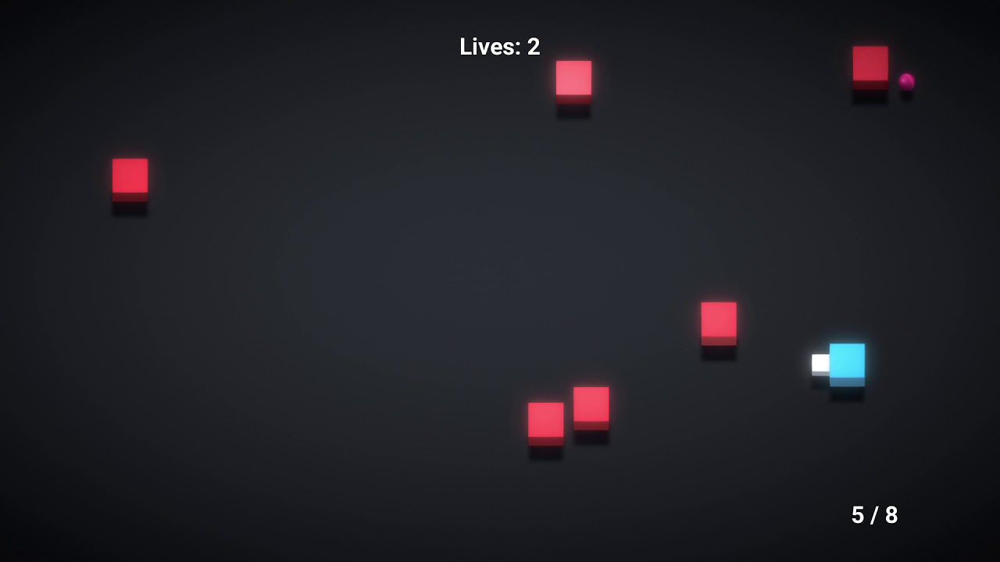

## About Me

👨‍💻 I'm a 2nd-year Software Engineering student at Sheffield Hallam University, currently seeking a placement opportunity.

🌟 Driven by curiosity and a passion for continuous learning, I immerse myself in the world of coding. Beyond the screen, you'll find me playing guitar, enjoying music, exploring video games, and following my favorite content creators.

Feel free to reach out if you have any questions or if you'd like to know more!

## Projects
- **Project 1:** "Shoot Shoot Game" is a top-down, endless shooter game that holds a special place in my heart. Developed during my time in college as part of a game development course using Unity, this project remains a nostalgic favorite.

  

    
  

  
  First Taste of Completion:
  "Shoot Shoot Game" represents more than just a project; it stands as my first complete and proper game. As the inaugural creation that felt truly finished, it marks a significant milestone in my journey as a developer.
  
  Note:
  Unfortunately, the source code for "Shoot Shoot Game" is no longer available. However, you can catch a glimpse of the game's excitement and charm in the video above.
  
  

## GitHub Stats & Top Languages

## Programming Languages, Frameworks, Tools & Databases

### Languages:

### Frameworks:

### Tools:

### Databases:

### Development Environment:

Feel free to reach out for collaboration or just to say hi!
