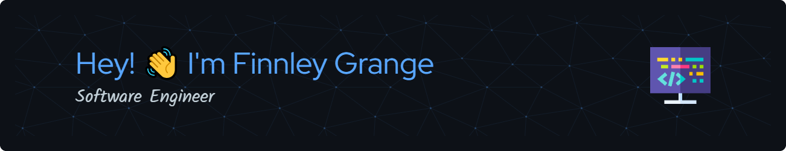

## About Me

- 👨‍💻 I'm a passionate C# developer with a love for building robust and scalable applications.
- 🌐 Currently exploring various technologies to broaden my skill set and stay adaptable in the ever-evolving tech landscape.
- 🚀 While I don't have specific aspirations yet, I'm always open to new challenges and learning experiences.
- 🎯 My coding journey involves working on a variety of projects, from small utilities to experimenting with different frameworks.
- 🌟 I believe in the power of curiosity and continuous learning, striving to improve my coding skills every day.
- 🎸 Outside of coding, you might find me enjoying music or diving into other creative pursuits.

## GitHub Stats & Top Languages

<!--
**finnleygrange/finnleygrange** is a ✨ _special_ ✨ repository because its `README.md` (this file) appears on your GitHub profile.

Here are some ideas to get you started:

- 🔭 I’m currently working on ...
- 🌱 I’m currently learning ...
- 👯 I’m looking to collaborate on ...
- 🤔 I’m looking for help with ...
- 💬 Ask me about ...
- 📫 How to reach me: ...
- 😄 Pronouns: ...
- ⚡ Fun fact: ...
-->
